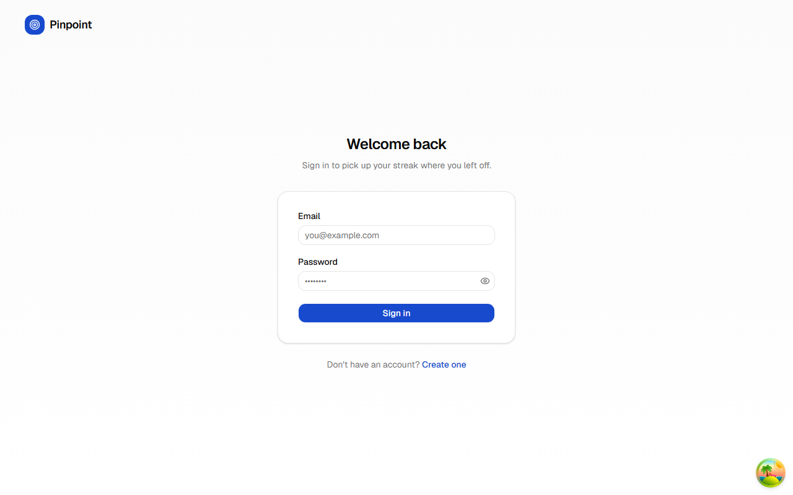
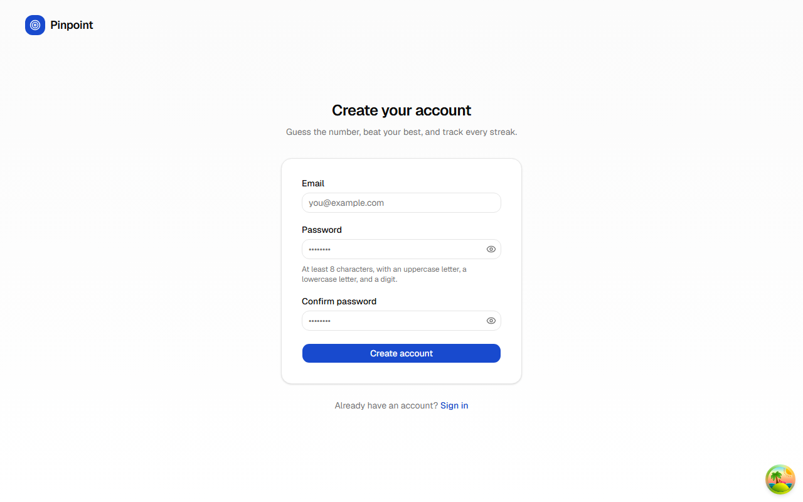
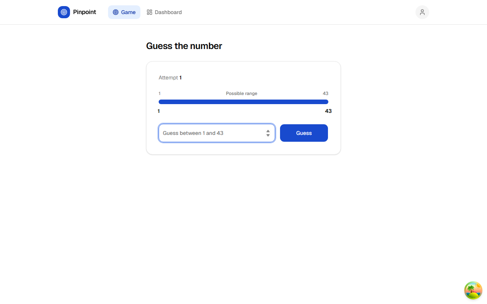
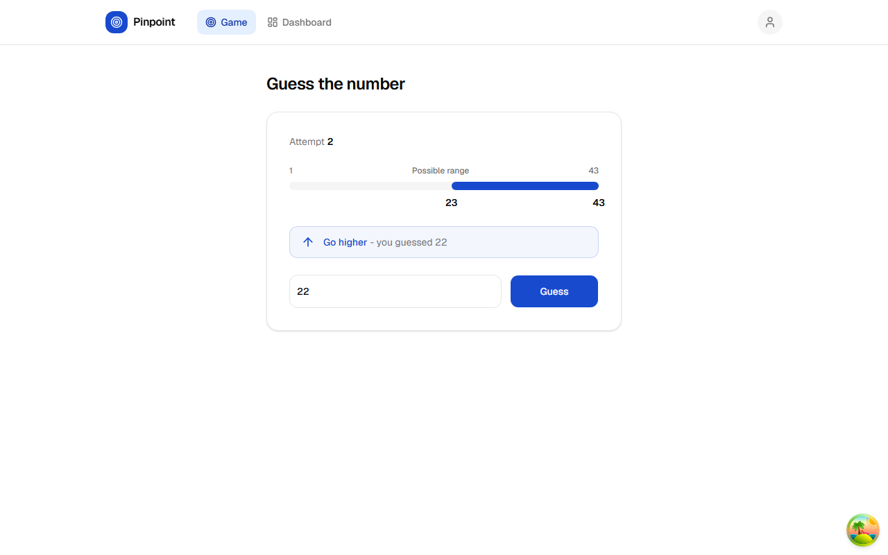
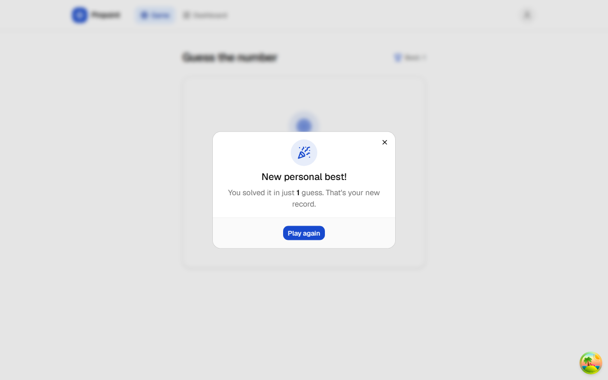
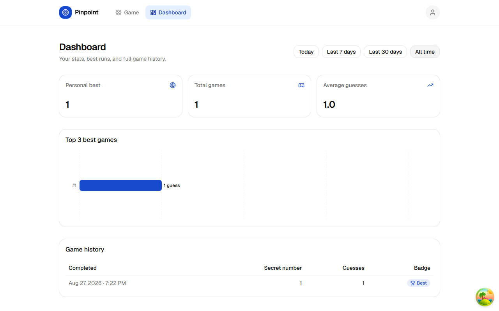
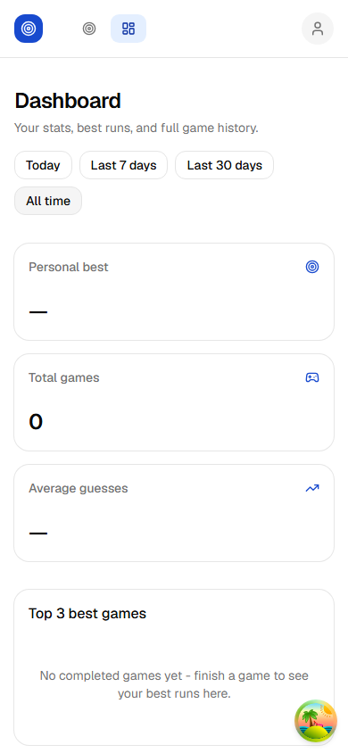

# Guessly Web

The frontend for **Pinpoint** — a "Guess the Number" game. React 19, TypeScript, Vite, Tailwind CSS, shadcn/ui.

The companion backend API lives in a separate repository, **guessly-api**. This repository has no backend source and does not need to be cloned alongside it — set `VITE_API_BASE_URL` to wherever that API is running and the two work together over HTTP.

## Table of contents

1. [Overview](#overview)
2. [Screenshots](#screenshots)
3. [Technology stack](#technology-stack)
4. [Structure](#structure)
5. [State management](#state-management)
6. [API configuration](#api-configuration)
7. [Local development](#local-development)
8. [Docker](#docker)
9. [Tests](#tests)
10. [Build](#build)
11. [CI](#ci)
12. [UI/UX notes](#uiux-notes)

## Overview

Register, log in, guess a secret number between 1 and 43 with live `HIGHER`/`LOWER`/`CORRECT` feedback and a visibly narrowing possible-range indicator, then review personal-best stats, a Top 3 chart, and full game history on a dedicated dashboard — with server-side date filtering and pagination throughout.

## Screenshots

| | |
|---|---|
|  |  |
|  |  |
|  |  |
|  | |

## Technology stack

React 19 · TypeScript · Vite · Tailwind CSS v4 · shadcn/ui · Axios · TanStack Query v5 · Zustand · React Hook Form + Zod · React Router v7 · Recharts · Vitest · React Testing Library · MSW

## Structure

```
src/
  app/                # providers, router, TanStack Query client config
  components/
    ui/               # shadcn/ui primitives
    layout/           # AppShell (navbar), AuthLayout
  features/
    auth/             # api, components, hooks, pages, zod schemas
    game/              # api, components, hooks, pages
    dashboard/          # api, components, hooks, pages
  lib/                # axios client, cn() utility
  stores/             # Zustand — auth/session state only
  types/              # API contract types, hand-kept in sync with the backend
  test/               # renderWithProviders, MSW server & handlers, setup
```

## State management

TanStack Query owns all server state — current game, dashboard, history. Zustand owns only the client-side auth session (token + user + expiry), persisted to `localStorage` so a page refresh doesn't log the user out. Server data is never duplicated into Zustand.

A persisted session is expiry-checked as soon as it's read back from storage — a token past its `expiresAtUtc` is discarded before any component ever sees it as authenticated, rather than being sent to the API and rejected. The dashboard/current-game/history queries are gated on `isAuthenticated`, so they never fire without a valid session in the first place.

All HTTP calls go through one centralized Axios client (`lib/api-client.ts`), which attaches the current bearer token (read fresh from the store on every request, never a stale reference) and normalizes every error response into a single `ApiError` type — components never call `axios` directly. Ending a session — whether from an explicit logout or the API rejecting an expired/invalid token — is handled in one place: a store subscription in `app/query-client.ts` clears all cached query data the moment `isAuthenticated` flips to `false`, so a new session never starts with a previous user's data still in cache.

## API configuration

The backend base URL comes entirely from environment configuration — never hardcoded:

```ts
// lib/api-client.ts
baseURL: import.meta.env.VITE_API_BASE_URL
```

Copy [`.env.example`](.env.example) to `.env` (or `.env.development` for local dev) and set:

```
VITE_API_BASE_URL=http://localhost:5297
```

Vite inlines `VITE_*` variables at **build** time. Anything in a `VITE_*` variable ends up readable in the browser's bundled JavaScript — never put secrets (API keys, tokens, credentials) in one.

## Local development

Prerequisites: Node.js 22+, and the `guessly-api` backend running somewhere reachable (see that repository's README).

```bash
npm install
npm run dev
# → http://localhost:5173
```

`.env.development` ships committed with a working default (`VITE_API_BASE_URL=http://localhost:5297`) — edit it if your backend runs elsewhere.

## Docker

This repository is self-contained and independently deployable — the image it builds contains only the frontend, served as static files by nginx.

**Docker Compose** (recommended for local use — reads `VITE_API_BASE_URL` from `.env`, defaulting to `http://localhost:5297`):

```bash
docker compose up --build
# → http://localhost:5173
```

**Plain Docker build/run** (the existing way, still supported — useful when you want to pass the build arg directly instead of via `.env`, or push the image elsewhere):

```bash
docker build --build-arg VITE_API_BASE_URL=http://localhost:5297 -t guessly-web .
docker run -p 5173:80 guessly-web
```

Because Vite bakes `VITE_API_BASE_URL` into the JavaScript bundle at build time, it must be supplied as a Docker **build argument**, not a container runtime environment variable — a value set with `docker run -e` after the image is built has no effect. This is true for both approaches above: `docker-compose.yml` passes it through as a build arg the same way, just sourced from `.env` instead of the command line.

`nginx.conf` serves the built `dist/` output with SPA fallback routing (so a direct load of `/dashboard` doesn't 404) and long-lived cache headers for hashed assets.

## Tests

```bash
npm run test          # single run
npm run test:watch    # watch mode
```

44 tests across 10 files: the auth store (including expired-session rehydration), the centralized Axios client (Bearer header attached/omitted, read fresh per request, cleared on a 401), the query client's logout-driven cache clearing, both route guards (including a mid-session logout redirect), the profile menu (opens without crashing, logout actually clears the session), the login/register forms, the full game page (start/guess/`HIGHER`/`LOWER`/`CORRECT`/personal-best celebration/error states/no request without a session), and the dashboard page (stats/chart/history/date filter/empty/error states).

Tests use MSW to intercept HTTP at the network boundary rather than mocking Axios per-component, and a shared `renderWithProviders()` helper wires up TanStack Query, React Router, and the tooltip/toast providers consistently.

## Build

```bash
npm run build      # tsc -b && vite build
npm run typecheck   # tsc -b --noEmit
npm run lint         # oxlint
```

Routes are code-split (`React.lazy`) so the initial bundle doesn't pull in the dashboard's charting library until it's needed.

## CI

`.github/workflows/ci.yml` runs on every push/PR to `main`: `npm ci` → `lint` → `typecheck` → `test` → `build`, plus a separate job that builds the Docker image to catch Dockerfile regressions early.

## UI/UX notes

- Every async view has a matching skeleton, empty state, and error state with retry — no generic centered spinner for page-level loading.
- The in-game range bar narrows visibly with each `HIGHER`/`LOWER` result, without the frontend ever computing or knowing the secret number itself — the backend remains the sole source of truth.
- "New Personal Best!" fires only when a completed game beats the player's *all-time* record, independent of whatever date filter is currently selected on the dashboard.
- Responsive down to a 390px mobile viewport.
